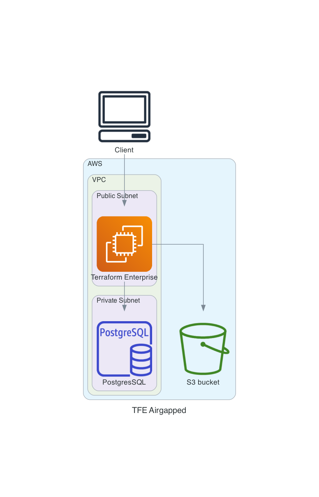

# Terraform Enterprise Airgapped installation with valid certificates on AWS  
This repository installs an Airgapped Terraform Enterprise (TFE) with valid certificates in AWS on a Ubuntu virtual machine.  

This terraform code creates
- A VPC
- Subnets
- Internet gateway
- Route Table
- A key pair
- A security group
- Security group rules
- S3 Bucket
- PostgreSQL Database
- An Elastic IP
- A Route53 DNS entry
- Valid certificates
- An Ubuntu virtual machine (22.04)
  - Replicated configuration
  - TFE settings json
  - Install latest TFE
  - TFE Admin account

# Diagram

# Prerequisites
 - An AWS account with default VPC and internet access.
 - TFE Airgap installation file
 - A TFE license
 - Docker libraries

# How to install TFE with valid certficates on AWS

# TODO
- [ ] Create security groups
- [ ] Create a security group rules
- [ ] Create valid certificates
- [ ] Create DNS record
- [ ] Create an EC2 instance
- [ ] Install TFE 
  - [ ] Create settings.json
  - [ ] Create replicated.conf
  - [ ] Copy certificates
  - [ ] Copy license.rli
  - [ ] Create admin user
- [ ] Documentation
- [ ] Use template file instead of shell script

# DONE
- [x] Create manually
- [x] Add diagram
- [x] Create VPC
- [x] Create Subnets
- [x] Create Internet gateway
- [x] Change default Route Table
- [x] Create Key pair